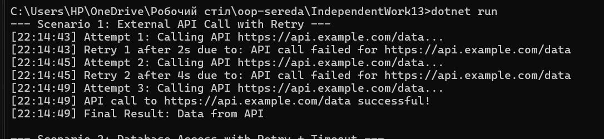
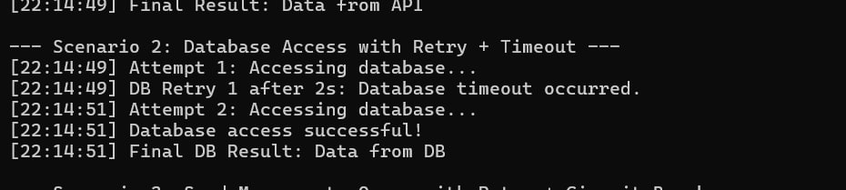
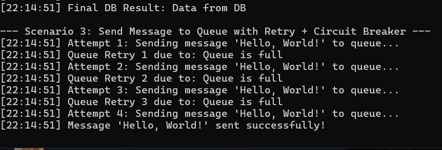

# IndependentWork13 - Polly Scenarios

Проєкт демонструє використання бібліотеки Polly для підвищення відмовостійкості .NET-застосунків.
Реалізовані три сценарії: виклик зовнішнього API, доступ до бази даних та відправка повідомлень у чергу.

## Scenario 1: External API Call

Проблема: Зовнішній API може тимчасово бути недоступним або повертати помилки.  

Обґрунтування політики Polly: Використовується Retry з експоненційною затримкою, щоб автоматично повторювати спроби при тимчасових помилках API і зменшувати ймовірність повного збою операції.

Очікувана поведінка та вивід логів: При першій та другій спробі буде лог про помилку і повторну спробу. Третя спроба успішна — лог про успішний виклик API та вивід результату.

## Фрагмент коду:
csharp
var apiRetryPolicy = Policy
    .Handle<HttpRequestException>()
    .WaitAndRetry(3, attempt => TimeSpan.FromSeconds(Math.Pow(2, attempt)),
        (ex, timeSpan, retryCount, context) =>
        {
            Console.WriteLine($"[{DateTime.Now:HH:mm:ss}] Retry {retryCount} after {timeSpan.TotalSeconds}s due to: {ex.Message}");
        });

## Приклад виведення:

## Scenario 2: Database Access

Проблема: База даних може бути недоступною або операція займати надто багато часу.  

Обґрунтування політики Polly: Використовується комбінація Retry + Timeout. Retry дозволяє повторювати спроби при тимчасових помилках доступу, а Timeout запобігає зависанню програми при довгих операціях.

Очікувана поведінка та вивід логів: При першій спробі база «зависає» — лог про таймаут та повторну спробу через 2 секунди. Друга спроба успішна — лог про успішний доступ до бази і вивід результату.

## Фрагмент коду:
csharp
var dbPolicy = Policy
    .Handle<TimeoutException>()
    .WaitAndRetry(2, _ => TimeSpan.FromSeconds(2), 
        (ex, timeSpan, retryCount, context) =>
        {
            Console.WriteLine($"[{DateTime.Now:HH:mm:ss}] DB Retry {retryCount} after {timeSpan.TotalSeconds}s: {ex.Message}");
        })
    .Wrap(Policy.Timeout(5, Polly.Timeout.TimeoutStrategy.Pessimistic, 
        (context, timeSpan, task) =>
        {
            Console.WriteLine($"[{DateTime.Now:HH:mm:ss}] Database operation timed out after {timeSpan.TotalSeconds}s");
        }));

string dbResult = dbPolicy.Execute(() => AccessDatabase());

## Приклад виведення:

## Scenario 3: Send Message to Queue

Проблема: Черга може бути перевантажена, і повідомлення не відправляються.  

Обґрунтування політики Polly: Використовується комбінація Retry + Circuit Breaker. Retry дозволяє автоматично повторювати спроби відправки, а Circuit Breaker захищає систему від перевантаження та повторних помилок у короткий період.

Очікувана поведінка та вивід логів: При перевантаженні черги перші три спроби — логи про повторні спроби. Після цього Circuit Breaker відкривається, лог про відкриття ланцюга. Коли черга звільняється, повідомлення успішно відправляється, лог про успішну відправку.

## Фрагмент коду:
csharp
var queuePolicy = Policy
    .Handle<InvalidOperationException>()
    .CircuitBreaker(2, TimeSpan.FromSeconds(10),
        (ex, breakDelay) => Console.WriteLine($"[{DateTime.Now:HH:mm:ss}] Circuit opened due to: {ex.Message}"),
        () => Console.WriteLine($"[{DateTime.Now:HH:mm:ss}] Circuit closed, retrying operations."))
    .Wrap(Policy.Handle<InvalidOperationException>().Retry(3, (ex, retryCount) =>
        {
            Console.WriteLine($"[{DateTime.Now:HH:mm:ss}] Queue Retry {retryCount} due to: {ex.Message}");
        }));

queuePolicy.Execute(() => SendMessageToQueue("Hello, World!"));

## Приклад виведення:

## Висновки

Polly дозволяє автоматизувати повторні спроби при тимчасових помилках. Timeout контролює довгі операції та запобігає зависанню застосунку. Circuit Breaker захищає ресурси від перевантаження та помилок. Використання Polly підвищує стабільність та відмовостійкість .NET-застосунків. Код залишається чистим та легко модифікується для різних сценаріїв.
