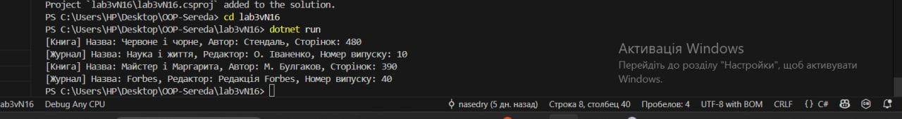

# Lab 3: Inheritance and Polymorphism

## Тема:
Успадкування, віртуальні методи, поліморфізм у C#

## Мета:
Навчитися реалізовувати ієрархію класів з використанням успадкування, віртуальних методів, а також демонструвати поліморфізм на прикладі.

## Опис:
- Створено базовий клас `Publication` з віртуальним методом `GetInfo()`
- Створено похідні класи `Book` та `Magazine`, що перевизначають `GetInfo()`
- Створено список об'єктів базового типу `Publication`, який містить об'єкти `Book` та `Magazine`
- Реалізовано поліморфізм за допомогою виклику методу `GetInfo()` в циклі

## Приклад виводу:

[Книга] Назва: Червоне і чорне, Автор: Стендаль, Сторінок: 480
[Журнал] Назва: Наука і життя, Редактор: О. Іваненко, Номер випуску: 10
[Книга] Назва: Майстер і Маргарита, Автор: М. Булгаков, Сторінок: 390
[Журнал] Назва: Forbes, Редактор: Редакція Forbes, Номер випуску: 40

## Приклад запуску:

## Контрольні питання:
1.Що таке наслідування та для чого воно використовується?
2.Чим відрізняється virtual від abstract методу?
3.Як працює ключове слово base?
4.Що таке поліморфізм часу виконання?
5.У чому різниця між композицією та наслідуванням?

## Відповіді:
1.Наслідування — це коли один клас бере змінні, методи та інше від іншого класу,щоб не писати один і той самий код кілька разів.
2.virtual — метод вже має свою реалізацію,його можна змінити в дочірньому класі, а abstract взагалі не має реалізації,його треба обов'язково писати в дочірньому класі.
3.Дозволяє звернутися до базового класу.
4.Це коли метод працює по-різному для різних об'єктів, навіть якщо викликається однаково.
5.У наслідуванні один клас успадковує інший,а композиція коли один клас містить інший.
